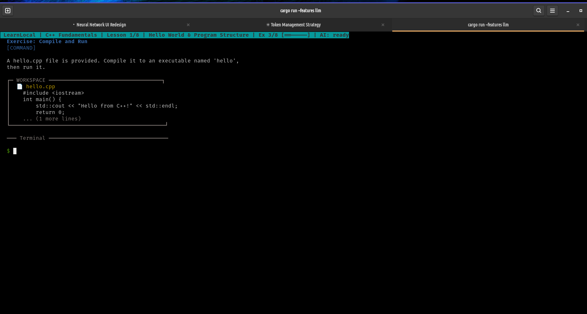
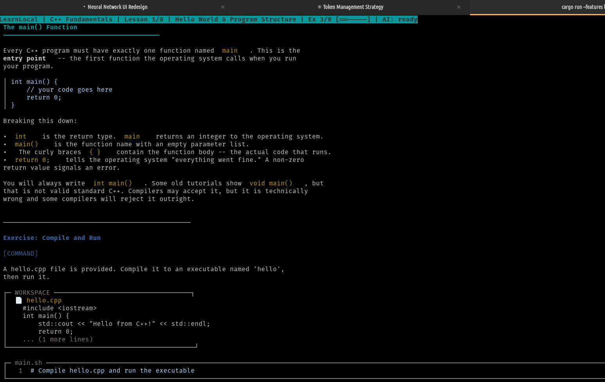

# LearnLocal

Offline terminal-based programming tutorials. Like `vimtutor`, for any language.

[](https://github.com/thehighnotes/learnlocal/actions/workflows/ci.yml)
[](LICENSE-MIT)

<p align="center">
  
  
</p>

## The Problem

Most programming tutorials require a browser, an account, and a constant internet connection. You create yet another login, wait for a cloud IDE to spin up, and hope your Wi-Fi holds. If you're on a train, a plane, or just behind a slow connection — you're stuck.

## The Solution

LearnLocal runs entirely in your terminal, entirely offline. Install it, pick a course, and start coding. No sign-up, no browser, no cloud. Your code never leaves your machine.

```bash
learnlocal
```

That's it. You're learning.

## Features

- **10 courses, 500+ exercises** — from C++ to AI to production debugging
- **Fully offline** — no internet required after install
- **Terminal native** — runs anywhere a terminal runs, including SSH
- **Your editor** — uses your `$EDITOR` (vim, nano, helix, whatever you prefer)
- **Interactive TUI** — markdown-rendered lessons, progress tracking, theme switching
- **Shell mode** — hands-on command-line exercises for Linux and Git courses
- **Sandboxed execution** — your exercises run in isolated temp directories with timeouts
- **Built-in SQLite** — SQL courses work out of the box, no database setup needed
- **Optional AI hints** — connect to a local [Ollama](https://ollama.com) instance for AI-powered help (no data leaves your machine)
- **Course authoring** — create your own courses with YAML + Markdown
- **Community platform** — browse, download, rate, and review community courses
- **Publish courses** — share your courses with the community via `learnlocal author publish`

## Course Catalog

| Course | Exercises | What You'll Learn |
|--------|:---------:|-------------------|
| **C++ Fundamentals** | 58 | Variables, control flow, functions, arrays, pointers, structs |
| **Python Fundamentals** | 57 | Variables, control flow, functions, data structures, file I/O |
| **JavaScript (Node.js)** | 58 | Variables, control flow, functions, arrays, objects, modern ES6+ |
| **Rust Fundamentals** | 57 | Ownership, borrowing, pattern matching, error handling, traits |
| **Go Fundamentals** | 58 | Syntax, goroutines, channels, standard library |
| **AI Fundamentals (Python)** | 57 | Vectors, neural networks, backprop, attention mechanisms |
| **Linux Fundamentals** | 55 | Filesystem, permissions, pipes, grep, text processing |
| **SQL (SQLite)** | 55 | Queries, joins, schemas, aggregation, data manipulation |
| **Git Time Travel** | 42 | Rescue missions, conflict resolution, recovering lost commits |
| **Production Incident Simulator** | 42 | Log analysis, debugging, real sysadmin scenarios |

## Prerequisites

| Component | Details |
|-----------|---------|
| **OS** | Linux or macOS (Windows support is experimental) |
| **Rust toolchain** | Install from [rustup.rs](https://rustup.rs) if you don't have it |
| **A terminal** | Any terminal emulator, 80x24 minimum |
| **Language tools** | Only for the courses you want to take (e.g., `g++` for C++, `python3` for Python) |

> **Don't have a language installed?** Run `learnlocal doctor` to check what's available and get install suggestions.

## Quick Start

### 1. Install Rust (if you don't have it)

```bash
curl --proto '=https' --tlsv1.2 -sSf https://sh.rustup.rs | sh
source ~/.cargo/env
```

### 2. Clone and build

```bash
git clone https://github.com/thehighnotes/learnlocal.git
cd learnlocal
cargo install --path .
```

### 3. Launch

```bash
learnlocal
```

Use arrow keys to browse courses, press Enter to start one. That's the whole workflow.

### 4. (Optional) Enable AI hints

If you have [Ollama](https://ollama.com) running locally, rebuild with LLM support:

```bash
cargo install --path . --features llm
```

Then enable it in the settings screen inside the TUI, or in `~/.config/learnlocal/config.yaml`.

## How It Works

1. **Pick a course** — the home screen lists all available courses with your progress
2. **Read the lesson** — each lesson opens with a markdown-rendered explanation
3. **Solve exercises** — write code in your editor, then submit to check your solution
4. **Get feedback** — see compiler output, diff against expected output, or use AI hints
5. **Track progress** — your progress is saved automatically between sessions

### Exercise Types

| Type | How it works |
|------|-------------|
| **Code exercises** | Write code, compile/run, output is checked against expected result |
| **Shell exercises** | Drop into a real shell to run commands, environment is validated after |
| **SQL exercises** | Write queries against a built-in SQLite database |
| **Multi-file exercises** | Edit multiple files (e.g., header + source in C++) |

## CLI Reference

```
learnlocal                           # Launch the TUI (browse and learn)
learnlocal list                      # List all available courses
learnlocal start <course-id>         # Jump directly into a course
learnlocal progress <course-id>      # See your progress in a course
learnlocal reset <course-id>         # Reset progress (creates a backup first)
learnlocal doctor                    # Check if your system has the right tools
learnlocal validate <dir>            # Validate a course directory (for authors)
learnlocal init <name>               # Scaffold a new course directory
learnlocal export <course-id>        # Export progress as JSON or CSV
learnlocal completions <shell>       # Generate shell completions (bash/zsh/fish)

# Community
learnlocal browse                    # Browse community courses (or press [b] in TUI)
learnlocal install <course-id>       # Download and install a community course
learnlocal login                     # Log in with GitHub for community features
learnlocal logout                    # Log out
learnlocal rate <course-id> <1-5>    # Rate a course
learnlocal review <course-id> "..."  # Write a review

# Authoring
learnlocal author publish <dir>      # Package and publish a course
learnlocal author publish <dir> --dry-run  # Pre-flight checks only
learnlocal author run-solution <dir> --lesson <id> --exercise <id>
learnlocal author run-all-solutions <dir>
```

| Flag | Purpose |
|------|---------|
| `--courses <dir>` | Use a custom courses directory instead of the built-in one |
| `--verbose` | Show detailed logs for troubleshooting exercise failures |

## Keyboard Shortcuts

| Key | Action |
|-----|--------|
| `Enter` | Open course / start exercise / submit solution |
| `e` | Open exercise in inline editor |
| `E` (Shift+e) | Open exercise in your `$EDITOR` |
| `h` | Show/reveal hints |
| `s` | Skip exercise |
| `r` | Run code without submitting |
| `q` | Quit / go back |
| `?` | Show help |

## Comparison

| | LearnLocal | Exercism | Codecademy | Rustlings | vimtutor |
|---|---|---|---|---|---|
| Offline | **Yes** | No | No | Yes | Yes |
| Terminal-native | **Yes** | CLI submit | No | Yes | Yes |
| Multi-language | **Yes (10)** | Yes | Yes | Rust only | Vim only |
| Your `$EDITOR` | **Yes** | No | No | Yes | No |
| AI hints | **Optional** | No | Paid | No | No |
| Free | **Yes** | Yes | Freemium | Yes | Yes |
| Custom courses | **Yes** | No | No | No | No |
| No sign-up | **Yes** | No | No | Yes | Yes |

## Configuration

LearnLocal stores its files in standard locations:

| File | Location |
|------|----------|
| Config | `~/.config/learnlocal/config.yaml` |
| Progress | `~/.local/share/learnlocal/progress.json` |
| Crash logs | `./learnlocal-crash.log` |

You can configure editor preference, sandbox level, theme (default or high-contrast), and AI settings either through the in-app Settings screen or by editing `config.yaml` directly.

## Troubleshooting

| Issue | Fix |
|-------|-----|
| "command not found" after install | Run `source ~/.cargo/env` or restart your terminal |
| Exercise won't compile | Run `learnlocal doctor` to check if the language tools are installed |
| Terminal looks garbled | Make sure your terminal is at least 80 columns wide and 24 rows tall |
| Progress seems lost after course update | Progress is tied to the course's major version — a v2.0 course starts fresh |
| AI hints not showing | Rebuild with `--features llm` and ensure Ollama is running (`ollama serve`) |
| Crash on startup | Check `learnlocal-crash.log` for details and open an issue |

## Creating Your Own Courses

LearnLocal courses are just YAML + Markdown — no Rust knowledge needed.

```bash
learnlocal init my-course      # scaffold a course directory
learnlocal validate my-course/ # validate before sharing
```

Courses follow a simple structure:
```
my-course/
  course.yaml          # course metadata and language config
  lessons/
    01-intro/
      lesson.md        # lesson content (Markdown)
      exercises/
        01-hello.yaml  # exercise definition
```

See the built-in courses in `courses/` for real examples.

## Community

LearnLocal has a built-in community platform for discovering and sharing courses.

### Browse & Install

```bash
learnlocal browse                    # See what's available
learnlocal browse --search python    # Filter by language or topic
learnlocal install python-advanced   # Download and install
```

Or press `[b]` on the TUI home screen for an interactive browse experience with search, sort, and course details.

### Publish Your Course

```bash
learnlocal login                                 # Authenticate with GitHub
learnlocal author publish courses/my-course      # Package + upload
```

Published courses go through a review process before appearing in the catalog. The pre-flight check validates your course structure, and the server verifies the package integrity on upload.

### Rate & Review

```bash
learnlocal rate python-advanced 5
learnlocal review python-advanced "Clear explanations, great exercises!"
```

Ratings and reviews help other learners find quality content. One rating and one review per course per user.

### Fork Attribution

When you create a course based on someone else's work, set `forked_from` in your manifest. The full authorship chain is preserved and visible to students — original authors always get credit.

## Contributing

Issues and pull requests are welcome. When reporting bugs, please include:

- Output of `learnlocal doctor`
- Your OS and terminal emulator
- The course and exercise where the issue occurred
- Full error output (run with `--verbose` for more detail)

## Part of the AIquest Research Lab

LearnLocal is part of the [AIquest](https://aiquest.info) research ecosystem — tools for learning, inference, and AI research that respect your privacy and work offline.

Explore all projects at [aiquest.info/research](https://aiquest.info/research).

## License

Code is dual-licensed under [MIT](LICENSE-MIT) or [Apache-2.0](LICENSE-APACHE), at your option.

Course content in `courses/` is licensed under [CC-BY-4.0](LICENSE-COURSES).
